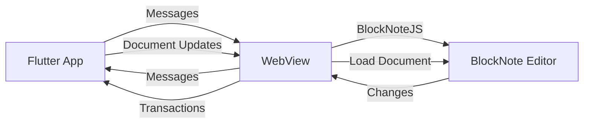

# Flutter BlockNote Editor

[](https://pub.dev/packages/flutter_blocknote_editor)
[](LICENSE)
[](https://flutter.dev)

> **⚠️ BETA VERSION WARNING**
>
> This is a **beta version** of the Flutter BlockNote Editor package. We've just started working on it, and there may be bugs and incomplete features. We're actively working on fixes and improvements. Please report any issues you encounter.

A Flutter package that embeds [BlockNoteJS](https://github.com/TypeCellOS/BlockNote) inside a WebView with bidirectional communication, transaction batching, and undo/redo safety.

<p align="center">
  <a href="https://www.blocknotejs.org">
    
  </a>
</p>

<p align="center">
  BlockNote is an open source Block-Based rich text editor. This Flutter package brings BlockNote's modern text editing experience to your Flutter apps.
</p>

<p align="center">
  <a href="https://www.blocknotejs.org">Homepage</a> - 
  <a href="https://www.blocknotejs.org/docs">Documentation</a> - 
  <a href="https://www.blocknotejs.org/examples">Examples</a>
</p>


## What We Support

### Features

- ✅ **WebView Integration**: Embeds BlockNoteJS editor in a WebView for iOS and Android
- ✅ **Bidirectional Communication**: Type-safe message protocol between Flutter and JavaScript
- ✅ **Transaction Batching**: Efficient batching system prevents excessive Flutter rebuilds
- ✅ **Undo/Redo Safety**: Undo/redo operations remain entirely within the JavaScript editor
- ✅ **Offline Support**: JavaScript bundle embedded locally via assets
- ✅ **Custom Themes**: Customize editor colors, fonts, and styling
- ✅ **Custom Toolbar**: Configure formatting toolbar buttons
- ✅ **Custom Slash Commands**: Add custom slash menu items
- ✅ **Custom Schemas**: Register custom blocks, inline content, and styles
- ✅ **Read-only Mode**: Toggle editor between editable and read-only states
- ✅ **Document Loading**: Load initial documents with blocks and content
- ✅ **Transaction Handling**: Receive and process editor changes via transactions

### Platform Support

- ✅ **iOS** (via `flutter_inappwebview`)
- ✅ **Android** (via `flutter_inappwebview`)
- ❌ **Web** (not yet supported - WebView limitations)

## How It Works

The package embeds BlockNoteJS inside a Flutter WebView and establishes bidirectional communication through a message channel. Here's the architecture:



### Key Components

1. **BlockNoteEditor Widget**: Main Flutter widget that embeds the WebView
2. **JS Bridge**: Handles message protocol between Flutter and JavaScript
3. **Transaction Batcher**: Batches transactions to prevent excessive rebuilds
4. **Document Models**: Type-safe Dart models for documents, blocks, and transactions

### Transaction Batching

Transactions are automatically batched to prevent excessive Flutter rebuilds:

- **Default batch window**: 400ms
- **Immediate flush triggers**:
  - Paste operations
  - Delete block operations
  - App background
  - Widget disposal

### Undo/Redo Safety

The library follows strict undo/redo safety rules:

1. **Undo/redo operations are NEVER triggered from Flutter**. They remain entirely within the JavaScript BlockNote editor.
2. **Flutter NEVER re-applies transactions into the editor**. Once a transaction is emitted from JavaScript, it is considered final.
3. **On reload**: Load the full document, reset the editor once, then resume streaming transactions. This ensures undo/redo history is preserved.

## Installation

Add this package to your `pubspec.yaml`:

```yaml
dependencies:
  flutter_blocknote_editor:
    path: ../path/to/blocknotejs
```

Then run:

```bash
flutter pub get
```

## Usage

### Basic Usage

Simple editor with empty document:

```dart
import 'package:flutter_blocknote_editor/flutter_blocknote_editor.dart';

BlockNoteEditor(
  initialDocument: BlockNoteDocument.empty(),
  onReady: () {
    print('Editor is ready');
  },
)
```

### Handling Transactions

Receive editor changes via transactions:

```dart
BlockNoteEditor(
  initialDocument: BlockNoteDocument.empty(),
  onTransactions: (transactions) {
    for (final transaction in transactions) {
      print('Transaction base version: ${transaction.baseVersion}');
      for (final op in transaction.operations) {
        print('Operation: ${op.operation}, Block ID: ${op.blockId}');
      }
    }
  },
  onReady: () {
    print('Editor initialized');
  },
)
```

### Read-only Mode

Toggle between editable and read-only states:

```dart
BlockNoteEditor(
  initialDocument: BlockNoteDocument.empty(),
  readOnly: true, // Set to true for read-only mode
  onReady: () {
    print('Editor is ready');
  },
)
```

### Loading Initial Document

Load a document with existing content:

```dart
BlockNoteEditor(
  initialDocument: BlockNoteDocument(
    blocks: [
      BlockNoteBlock(
        id: 'block1',
        type: BlockNoteBlockType.paragraph,
        content: BlockNoteBlockContent.inline(
          content: [
            BlockNoteInlineContent.text(
              text: 'Hello, BlockNote!',
              styles: {'bold': true},
            ),
          ],
        ),
      ),
      BlockNoteBlock(
        id: 'block2',
        type: BlockNoteBlockType.heading,
        props: {
          'level': 1,
        },
        content: BlockNoteBlockContent.inline(
          content: [
            BlockNoteInlineContent.text(text: 'This is a heading'),
          ],
        ),
      ),
    ],
  ),
  onTransactions: (transactions) {
    // Handle transactions
  },
  onReady: () {
    print('Editor initialized with content');
  },
)
```

### Custom Theme

Apply custom colors, fonts, and styling:

```dart
BlockNoteEditor(
  initialDocument: BlockNoteDocument.empty(),
  theme: BlockNoteTheme(
    colors: BlockNoteColorScheme(
      editor: const BlockNoteColorPair(
        text: Color(0xFF222222),
        background: Color(0xFFFFFFFF),
      ),
      menu: const BlockNoteColorPair(
        text: Color(0xFFFFFFFF),
        background: Color(0xFF000000),
      ),
      tooltip: const BlockNoteColorPair(
        text: Color(0xFFFFFFFF),
        background: Color(0xFF333333),
      ),
      hovered: const BlockNoteColorPair(
        text: Color(0xFFFFFFFF),
        background: Color(0xFF444444),
      ),
      selected: const BlockNoteColorPair(
        text: Color(0xFFFFFFFF),
        background: Color(0xFF555555),
      ),
      shadow: const Color(0xFF000000),
      border: const Color(0xFFCCCCCC),
    ),
    borderRadius: 8,
    font: const BlockNoteFontConfig(
      family: "'Georgia', 'Times New Roman', serif",
    ),
  ),
  onReady: () {
    print('Editor with custom theme is ready');
  },
)
```

### Custom Toolbar

Customize formatting toolbar buttons:

```dart
BlockNoteEditor(
  initialDocument: BlockNoteDocument.empty(),
  toolbarConfig: BlockNoteToolbarConfig(
    buttons: [
      const BlockNoteToolbarButton(
        type: BlockNoteToolbarButtonType.blockTypeSelect,
      ),
      const BlockNoteToolbarButton(
        type: BlockNoteToolbarButtonType.basicTextStyleButton,
        basicTextStyle: BlockNoteBasicTextStyle.bold,
      ),
      const BlockNoteToolbarButton(
        type: BlockNoteToolbarButtonType.basicTextStyleButton,
        basicTextStyle: BlockNoteBasicTextStyle.italic,
      ),
      const BlockNoteToolbarButton(
        type: BlockNoteToolbarButtonType.basicTextStyleButton,
        basicTextStyle: BlockNoteBasicTextStyle.underline,
      ),
      const BlockNoteToolbarButton(
        type: BlockNoteToolbarButtonType.colorStyleButton,
      ),
      const BlockNoteToolbarButton(
        type: BlockNoteToolbarButtonType.createLinkButton,
      ),
    ],
  ),
  onReady: () {
    print('Editor with custom toolbar is ready');
  },
)
```

### Custom Slash Commands

Add custom slash menu items:

```dart
BlockNoteEditor(
  initialDocument: BlockNoteDocument.empty(),
  slashCommandConfig: BlockNoteSlashCommandConfig(
    items: [
      BlockNoteSlashCommandItem(
        title: 'Insert Hello World',
        onItemClick:
            "editor.insertBlocks([{type: 'paragraph', content: [{type: 'text', text: 'Hello World', styles: {bold: true}}]}], editor.getTextCursorPosition().block, 'after');",
        aliases: ['helloworld', 'hw'],
        group: 'Custom',
        subtext: 'Inserts a "Hello World" paragraph',
      ),
    ],
  ),
  onReady: () {
    print('Editor with custom slash commands is ready');
  },
)
```

### Custom Schemas (Custom Blocks)

Register custom blocks with JavaScript and enable them via schema config:

```dart
final customBlockScript = '''
(function() {
  const { createReactBlockSpec, React, registerBlockNoteCustomBlocks } =
    window.BlockNoteCustomSchema;

  const AgendaItemBlock = createReactBlockSpec(
    {
      type: 'agenda_item',
      content: 'none',
      propSchema: {
        title: { default: '' },
      },
    },
    {
      render: ({ block }) => {
        return React.createElement(
          'div',
          { className: 'agenda-item' },
          block.props.title || 'Agenda Item'
        );
      },
      toExternalHTML: ({ block }) => {
        const element = document.createElement('div');
        element.setAttribute('data-block-type', block.type);
        element.textContent = block.props.title || '';
        return { dom: element };
      },
    }
  );

  registerBlockNoteCustomBlocks({
    agenda_item: AgendaItemBlock,
  });
})();
''';

BlockNoteEditor(
  initialDocument: BlockNoteDocument.empty(),
  customJavaScript: customBlockScript,
  schemaConfig: {
    'blockSpecs': ['agenda_item'],
  },
  onReady: () {
    print('Editor with custom schema is ready');
  },
)
```

The `schemaConfig` map also supports `inlineContentSpecs` and `styleSpecs` with
the same array format to enable registered inline content and styles.

### Debug Logging

Enable debug logging for development:

```dart
BlockNoteEditor(
  initialDocument: BlockNoteDocument.empty(),
  debugLogging: true, // Enable debug logging
  onReady: () {
    print('Editor is ready');
  },
)
```

### Complete Example

Here's a complete example with state management:

```dart
import 'package:flutter/material.dart';
import 'package:flutter_blocknote_editor/flutter_blocknote_editor.dart';

class EditorPage extends StatefulWidget {
  const EditorPage({super.key});

  @override
  State<EditorPage> createState() => _EditorPageState();
}

class _EditorPageState extends State<EditorPage> {
  bool _isReady = false;
  bool _readOnly = false;
  BlockNoteDocument _document = BlockNoteDocument.empty();
  final List<BlockNoteTransaction> _transactions = [];

  @override
  Widget build(BuildContext context) {
    return Scaffold(
      appBar: AppBar(
        title: const Text('BlockNote Editor'),
        actions: [
          IconButton(
            icon: Icon(_readOnly ? Icons.lock : Icons.lock_open),
            onPressed: () {
              setState(() {
                _readOnly = !_readOnly;
              });
            },
            tooltip: _readOnly ? 'Enable editing' : 'Disable editing',
          ),
        ],
      ),
      body: Column(
        children: [
          if (_isReady)
            Container(
              padding: const EdgeInsets.all(8),
              color: Colors.green[100],
              child: const Text('Editor is ready'),
            ),
          Expanded(
            child: BlockNoteEditor(
              initialDocument: _document,
              onReady: () {
                setState(() {
                  _isReady = true;
                });
              },
              onTransactions: (transactions) {
                setState(() {
                  _transactions.addAll(transactions);
                });
              },
              readOnly: _readOnly,
            ),
          ),
        ],
      ),
    );
  }
}
```

## Known Issues

### Beta Version Limitations

This is a beta version, and we're actively working on fixes and improvements. You may encounter:

- Bugs and unexpected behavior
- Incomplete features
- Performance issues with very large documents
- Platform-specific issues

Please report any issues you encounter so we can fix them.

### BlockNoteJS Known Bugs

BlockNoteJS itself has known bugs that may affect this package. You can check the [BlockNoteJS GitHub Issues](https://github.com/TypeCellOS/BlockNote/issues) for a complete list.

**Critical Bug**: [Issue #2122](https://github.com/TypeCellOS/BlockNote/issues/2122) - On iOS Safari, when selecting text near the top of the editor, two overlapping menus appear (the native iOS text selection menu and the BlockNote toolbar). This makes it difficult or impossible to access the BlockNote toolbar features on mobile devices. This is a known issue in BlockNoteJS and is being tracked upstream.

## Credits

This Flutter package wraps [BlockNote](https://www.blocknotejs.org), an open source Block-Based rich text editor.

BlockNote builds directly on two awesome projects:
- [Prosemirror](https://prosemirror.net/) by Marijn Haverbeke
- [Tiptap](https://tiptap.dev/)

BlockNote is built as part of [TypeCell](https://www.typecell.org) and is sponsored by the [NLNet foundation](https://nlnet.nl/foundation/).

## License

This project is licensed under the MIT License.

BlockNote itself is licensed under the [MPL-2.0 license](https://github.com/TypeCellOS/BlockNote/blob/main/LICENSE-MPL.txt), which allows you to use BlockNote in commercial (and closed-source) applications.

## Contributing

Contributions are welcome! Please ensure all code complies with `analysis_options.yaml` and run `dart analyze` before submitting.

When contributing:

1. Follow the existing code style
2. Add tests for new features
3. Update documentation as needed
4. Run `dart fix --apply` and `dart analyze` before committing
